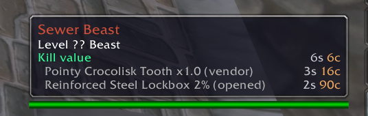

# OctoKillValue

Expected gold per kill on creature tooltips, for Turtle WoW and OctoWoW
(WoW 1.12 clients with the Turtle API).

Coins plus every drop weighted by its chance and stack, priced from the
auction house, the vendor, or what a container holds when opened. Under
the total: the top contributors with their source, a "rare drops" line
for the sub-0.1% tail, and skinning value when you have the skill.

`value = average coin drop + sum(drop chance x average stack x item price)`

Hover any creature. `/okv` with a target prints the full breakdown,
`/okv zone` ranks the best farm targets where you stand.

## Requirements

| | Needed for | Without it |
|---|---|---|
| **Turtle WoW / OctoWoW client** | identifying creatures (`UnitExists` returns a guid) | **nothing works** on a stock 1.12 client; the addon says so at login and in `/okv status` |
| [aux-addon](https://github.com/shirsig/aux-addon) (optional) | auction prices, disenchant estimate | vendor sell prices only; the tooltip line is tagged "(vendor only)" |
| [pfQuest](https://github.com/shagu/pfQuest) (optional, any variant) | `/okv zone`, names of items not yet in your client cache | no zone ranking; uncached items print as `item:<id>` |

Prices are read live from aux each time you hover, so scan the auction
house now and then and the numbers follow. There is nothing to maintain.

## Install

**OctoLauncher / GitAddonsManager:** add the repository URL
`https://github.com/Krool/OctoKillValue` as an addon. The clone lands as
`Interface\AddOns\OctoKillValue` and loads as-is.

**Manual:** download the release zip and put the `OctoKillValue` folder
into `Interface\AddOns`, so that `Interface\AddOns\OctoKillValue\OctoKillValue.toc`
exists.

At login the addon prints one line confirming it loaded, and a warning if
a requirement is missing (`/okv hello` turns the confirmation off).

## Commands

| command | effect |
|---|---|
| `/okv` | breakdown for your target: coins, top drops with source tags, rare tail, gather value |
| `/okv id <creatureId>` | breakdown for any creature entry |
| `/okv zone [n] [all]` | top n creatures in the current zone by kill value (needs pfQuest); non-elite unless `all`; shows level, rank and value per 1000 health |
| `/okv status` | requirement check with plain-language advice |
| `/okv guid` | raw guid of the target, parsed creature id, whether loot data exists |
| `/okv config` | every setting with its value and meaning |
| `/okv reset` | restore default settings |
| `/okv help` | command list |

Settings (saved per account):

| command | default | meaning |
|---|---|---|
| `/okv toggle` | on | tooltip line on/off |
| `/okv detail <n>` | 3 | contributor lines under the total (0 = none) |
| `/okv price value\|today` | value | aux source: lower median of daily observations, or today's minimum buyout |
| `/okv cut <pct>` | 5 | auction house cut taken off AH and disenchant values |
| `/okv rare <pct>` | 0.1 | drops below this chance are shown as "rare drops", outside the total |
| `/okv mindays <n>` | 3 | days an aux price above 50g must have been seen before it counts |
| `/okv vendor` | on | vendor sell price as fallback and floor |
| `/okv de` | off | also consider aux's disenchant estimate for gear |
| `/okv skin` | on | gather line when you have the skill (not part of the total) |
| `/okv friendly` | off | show the line on friendly NPCs (corpses always show) |
| `/okv hello` | on | login confirmation line |

## How prices are chosen

Each item takes the best of:

* **Auction:** the lower median of aux's raw daily minimum buyouts, minus
  the cut. Never for bind-on-pickup or poor-quality (grey) items. Random
  suffix gear ("of the Bear") uses the median of the suffix variants aux
  has seen. Prices above 50g must have been observed on 3 days.
* **Disenchant** (optional): aux's expectation for the item's quality,
  level and slot, minus the cut.
* **Vendor:** the sell price from the database.
* **Contents:** clams, lockboxes and gem bags are worth their expected
  contents when opened, if that beats the container's own price.

Quest items are a known 0. Bind-on-pickup items only ever use vendor or
disenchant value.

### Why the guards

Auction history contains troll listings: a grey figurine at 999g, a
one-off 166,000g buyout. aux's own "value" is a weighted median that
returns the higher of two observations, so one such listing next to one
real price wins, and multiplied through the world-drop pool every creature
shares it inflated every mob in the game. Hence the lower median, the
3-day rule for expensive items, the grey exclusion, and the separate
"rare drops" line where a bad price stays visible instead of hiding in
the total.

## Data

`Data.lua` is generated from the Turtle WoW 1.18.1 preservation database
(github.com/Penqle/tortoise-wow): coin ranges, every creature, reference,
skinning and container loot row with min/max stacks, group and reference
semantics resolved the way the server rolls them, plus vendor prices,
bonding, quality and disenchant info for every droppable item.

    node tools\gen-data.js

downloads the SQL into `tools\sqlcache` on first run and rewrites
`Data.lua`.

### Caveats

* Data is Turtle 1.18.1. OctoWoW-only creatures and any loot rebalances
  are not in it; those creatures show no line.
* Quest-conditional loot rows (negative chance) are skipped. Class or race
  conditioned rows count at full chance.
* Pickpocket loot is not included.
* Results are cached for 30 seconds per creature; settings changes flush it.

## Tests

    cd tools\test
    npm install
    npm test

Syntax-checks the Lua, validates `Data.lua` sentinels, then runs the real
addon under fengari with a stubbed WoW + aux environment (75 behavior
checks). GitHub Actions runs them on every push.

## License

MIT
